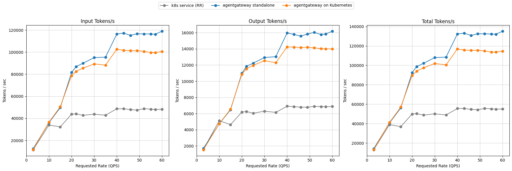
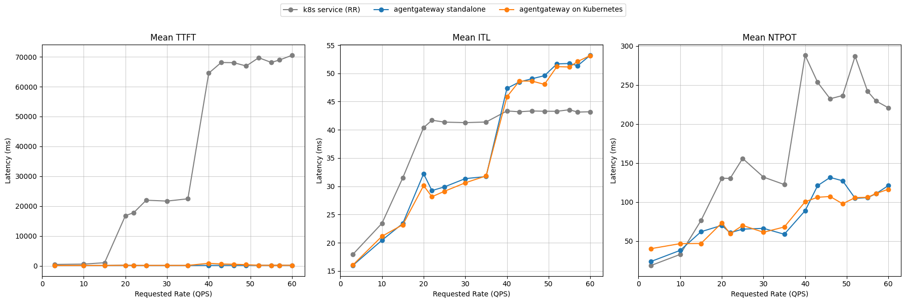
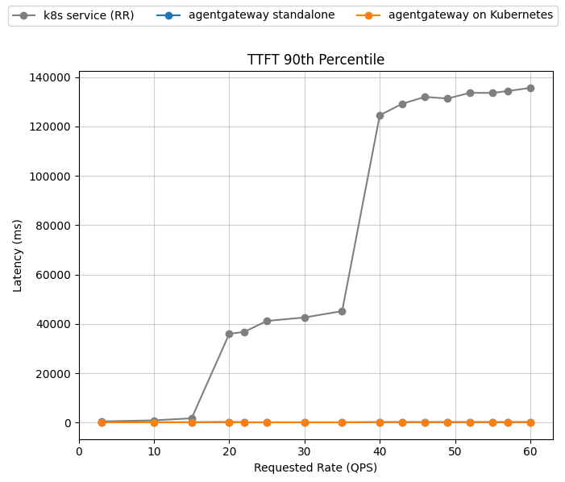

# Qwen3-32B on H100: service and agentgateway routing

This report compares a simple Kubernetes Service with agentgateway in
standalone and Kubernetes Gateway modes. The benchmark runs Qwen3-32B on
16 NVIDIA H100 GPUs across eight vLLM model servers (TP=2) using the
upstream optimized-baseline request-rate ladder.

> [!IMPORTANT]
> The three treatments were executed independently and are registered under
> this publication campaign. Each native evidence tree was complete when the
> report was generated, and all treatments share the same identity hashes,
> topology, workload, inference-perf revision, and ClusterIP endpoint path.
> Exact treatment timestamps are recorded in
> [campaign-provenance.yaml](campaign-provenance.yaml).

## Results

Summary at the top of the ladder (60 QPS), except peak output throughput:

| Metric | k8s service (RR) | agentgateway standalone | agentgateway on Kubernetes |
| :--- | ---: | ---: | ---: |
| Peak output tokens/s | 6,910 | 16,178 | 14,241 |
| Output tokens/s | 6,879 | 16,178 | 13,999 |
| Requests/s | 6.70 | 16.52 | 13.96 |
| TTFT p50 (ms) | 62,939.8 | 148.2 | 160.4 |
| TTFT p90 (ms) | 135,599.0 | 214.5 | 242.0 |
| ITL p50 (ms) | 30.3 | 52.7 | 49.6 |
| Failures (full ladder) | 0 | 0 | 0 |

The service treatment saturates earlier and accumulates long request queues;
agentgateway keeps TTFT substantially lower while sustaining higher output
throughput. All three treatments completed without request failures. Latency
must still be interpreted with throughput and failures because overload can
exclude timed-out requests from successful-request latency distributions.

<b><i>Click</i></b> to view output throughput across the full ladder

| Rate | k8s service (RR) | agentgateway standalone | agentgateway on Kubernetes |
| ---: | ---: | ---: | ---: |
| 3 | 1,570 | 1,694 | 1,520 |
| 10 | 5,113 | 4,723 | 4,739 |
| 15 | 4,634 | 6,480 | 6,547 |
| 20 | 6,182 | 10,974 | 10,853 |
| 22 | 6,255 | 11,831 | 11,530 |
| 25 | 6,044 | 12,227 | 11,959 |
| 30 | 6,296 | 12,923 | 12,532 |
| 35 | 6,145 | 13,032 | 12,279 |
| 40 | 6,910 | 15,964 | 14,241 |
| 43 | 6,858 | 15,781 | 14,216 |
| 46 | 6,800 | 15,566 | 14,163 |
| 49 | 6,780 | 15,834 | 14,205 |
| 52 | 6,893 | 16,031 | 14,116 |
| 55 | 6,865 | 15,766 | 14,024 |
| 57 | 6,840 | 15,829 | 13,988 |
| 60 | 6,879 | 16,178 | 13,999 |

<b><i>Click</i></b> to view TTFT p50 across the full ladder

TTFT values are milliseconds; lower is better.

| Rate | k8s service (RR) | agentgateway standalone | agentgateway on Kubernetes |
| ---: | ---: | ---: | ---: |
| 3 | 485.6 | 82.4 | 84.4 |
| 10 | 506.5 | 90.7 | 91.1 |
| 15 | 571.8 | 92.3 | 96.7 |
| 20 | 2,482.2 | 180.9 | 130.2 |
| 22 | 3,868.4 | 113.3 | 121.7 |
| 25 | 6,693.6 | 113.5 | 121.6 |
| 30 | 6,962.7 | 115.0 | 125.1 |
| 35 | 7,638.1 | 114.1 | 122.7 |
| 40 | 78,041.6 | 149.6 | 158.0 |
| 43 | 80,184.4 | 148.5 | 159.8 |
| 46 | 65,342.8 | 150.0 | 160.7 |
| 49 | 55,118.2 | 146.1 | 158.1 |
| 52 | 71,968.4 | 148.9 | 159.0 |
| 55 | 56,387.9 | 149.9 | 157.8 |
| 57 | 55,247.7 | 145.6 | 162.4 |
| 60 | 62,939.8 | 148.2 | 160.4 |

## Configuration

- Campaign: `optimized-baseline-v0230-gateway-refresh-20260817`
- Scenario and routing policy: `optimized-baseline` / `optimized-baseline`
- Model: `Qwen/Qwen3-32B`
- Backend: `docker.io/vllm/vllm-openai:v0.23.0`
- Accelerator: 16 × NVIDIA H100 80 GB
- Model servers: 8 with TP=2
- Workload: `upstream-optimized-baseline.yaml` (`upstream`)
- EPP/router chart: `v0.9.0` for agentgateway treatments
- agentgateway: `v1.4.1`
- Endpoint path: internal Kubernetes ClusterIP
- Repetitions per treatment: 1
- inference-perf revision: `e28d9a0bf5cefa743910b73057b3b686f0a94b98`

The repeated warm-up rate is excluded. With multiple repetitions, report
points are the median at each requested QPS; this campaign has one
repetition per treatment.

## Evidence

- [Campaign manifest](campaign-manifest.yaml)
- [Campaign provenance](campaign-provenance.yaml)
- [Normalized metrics](metrics.csv)

The native campaign evidence, including per-request output, runtime metrics,
rendered configuration, and logs, is retained outside Git under campaign ID
`optimized-baseline-v0230-gateway-refresh-20260817`. It is not linked here
because the local `benchmarking/inference/results` tree is intentionally
gitignored and no durable public archive URL has been assigned.
