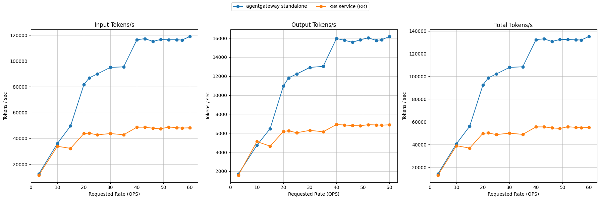
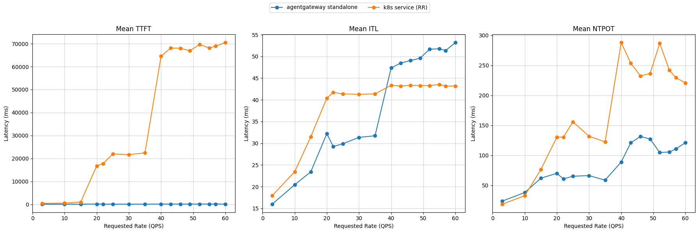
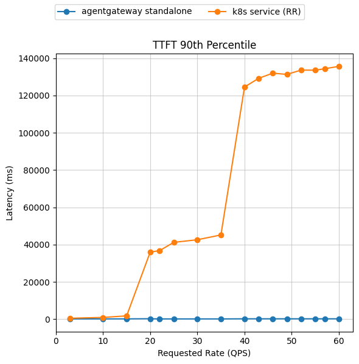

# Benchmark Report

The benchmark runs model Qwen/Qwen3-32B on 16 × H100 GPUs, distributed across 8 vLLM model servers (2 GPUs per server with TP=2). Workload is `upstream-optimized-baseline.yaml` driven across the configured request-rate ladder.

> [!NOTE]
> These results use the `optimized-baseline` routing policy. Latency is reported as median (p50) in the summary; NTPOT is end-to-end latency divided by output tokens. Missing latency histograms are shown as `n/a` and dropped from latency lines. Both treatments use the same model-server topology and workload.

## Comparing agentgateway standalone to a Simple Kubernetes Service (vLLM)

**agentgateway mode:** In standalone request scheduler mode, agentgateway runs as a sidecar proxy with the EPP and communicates with it over localhost, without a full Gateway API stack. [Learn more about standalone inference routing](https://agentgateway.dev/docs/standalone/latest/inference/#standalone-request-scheduler-mode).

Graphs below compare agentgateway standalone routing to a stock Kubernetes Service that round-robins requests across the same 8 vLLM pods (no EPP, no scoring). Tables abbreviate this baseline as `k8s service (RR)`, where RR means round-robin.

Summary (throughput is peak sustained; latencies at the top of the ladder, rate 60):

| Metric | k8s service (RR) | agentgateway standalone | Δ% vs k8s |
| :--- | :--- | :--- | :--- |
| Peak output tokens/s | 6,910 | 16,178 | +134.1% |
| Requests/sec (@ rate 60) | 6.70 | 16.52 | +146.5% |
| TTFT p50 (s) | 62.9 | 0.1 | −99.8% |
| TTFT p90 (s) | 135.6 | 0.2 | −99.8% |
| ITL p50 (ms) | 30.3 | 52.7 | +73.7% |

<b><i>Click</i></b> to view the per-rate breakdown across the full ladder

Output tokens/sec — higher is better; TTFT in seconds — lower is better. `n/a` means the stage had no successful-request latency histogram.

| Rate | k8s service (RR) Output | agentgateway standalone Output | k8s service (RR) TTFT p50 | agentgateway standalone TTFT p50 | k8s service (RR) TTFT p90 | agentgateway standalone TTFT p90 |
| ---: | ---: | ---: | ---: | ---: | ---: | ---: |
| 3 | 1,570 | 1,694 | 0.5 | 0.1 | 0.5 | 0.1 |
| 10 | 5,113 | 4,723 | 0.5 | 0.1 | 1.0 | 0.2 |
| 15 | 4,634 | 6,480 | 0.6 | 0.1 | 1.8 | 0.2 |
| 20 | 6,182 | 10,974 | 2.5 | 0.2 | 36.0 | 0.3 |
| 22 | 6,255 | 11,831 | 3.9 | 0.1 | 36.8 | 0.1 |
| 25 | 6,044 | 12,227 | 6.7 | 0.1 | 41.2 | 0.1 |
| 30 | 6,296 | 12,923 | 7.0 | 0.1 | 42.6 | 0.1 |
| 35 | 6,145 | 13,032 | 7.6 | 0.1 | 45.2 | 0.1 |
| 40 | 6,910 | 15,964 | 78.0 | 0.1 | 124.5 | 0.2 |
| 43 | 6,858 | 15,781 | 80.2 | 0.1 | 129.2 | 0.2 |
| 46 | 6,800 | 15,566 | 65.3 | 0.2 | 132.0 | 0.2 |
| 49 | 6,780 | 15,834 | 55.1 | 0.1 | 131.3 | 0.2 |
| 52 | 6,893 | 16,031 | 72.0 | 0.1 | 133.6 | 0.2 |
| 55 | 6,865 | 15,766 | 56.4 | 0.1 | 133.6 | 0.2 |
| 57 | 6,840 | 15,829 | 55.2 | 0.1 | 134.3 | 0.2 |
| 60 | 6,879 | 16,178 | 62.9 | 0.1 | 135.6 | 0.2 |

Latency must be interpreted together with failures. A treatment can show deceptively low latency under overload when slower requests time out and are excluded from successful-request latency distributions. Failure counts and rates are retained in `metrics.csv`.

## Interpreting ITL

At rate 60, k8s service (RR) has a lower p50 ITL (30.3 ms) than agentgateway standalone (52.7 ms). ITL measures token cadence only after the first response token; time waiting to enter prefill or decode appears in TTFT instead. Lower ITL therefore does not by itself mean better overall inference latency.

Here, k8s service (RR) peaks at 6,910 output tokens/s and has 62.9 s TTFT p50, while agentgateway standalone reaches 16,178 output tokens/s with 0.1 s TTFT p50. This is consistent with the Service queueing longer while the routed treatment keeps more work decoding; vLLM continuous batching can trade higher per-stream ITL for greater throughput and lower TTFT. At 3 QPS, ITL is 16.1 ms versus 15.7 ms, indicating that the larger high-load gap is not a fixed proxy penalty.

## Configuration

- Campaign: `optimized-baseline-v0230-gateway-refresh-20260817`
- Suite: `llm-d-benchmark`
- Scenario: `optimized-baseline`
- Model: `Qwen/Qwen3-32B`
- Backend: `vllm`
- Backend image/version: `docker.io/vllm/vllm-openai:v0.23.0`
- Accelerator: `h100`
- Model servers: 8 with TP=2
- Workload: `upstream-optimized-baseline.yaml` (`upstream`)
- Repetitions per treatment: 1
- Candidate components: agentgateway cr.agentgateway.dev/agentgateway:v1.4.1

Warm-up stages whose requested rate is repeated in the measured ladder are excluded. With multiple repetitions, each table and graph point is the median at that requested QPS.

## Evidence

- [k8s service (RR) native results](../../../../../results/llm-d-benchmark/optimized-baseline-v0230-gateway-refresh-20260817/runs/service)
- [agentgateway standalone native results](../../../../../results/llm-d-benchmark/optimized-baseline-v0230-gateway-refresh-20260817/runs/agentgateway-standalone)
- [Campaign manifest](../campaign-manifest.yaml)
- [Normalized metrics](metrics.csv)
