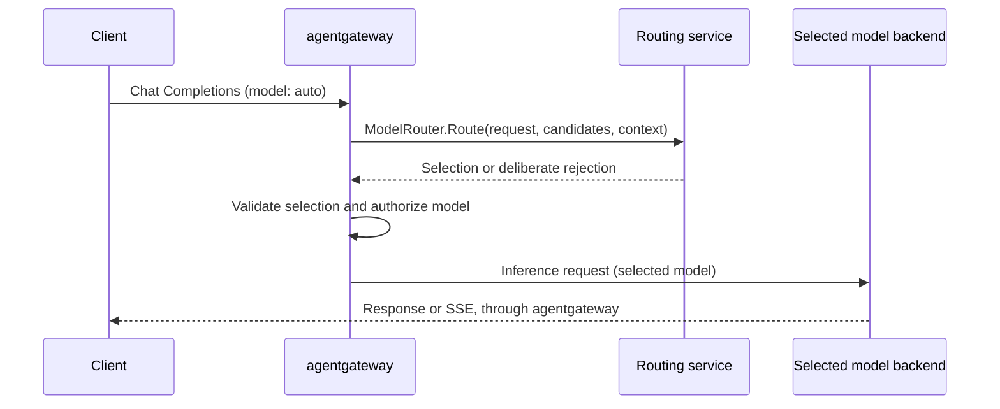

# gRPC model routing

The `grpcCallout` virtual-model strategy lets an external service select a
concrete model before inference. It complements the HTTP `callout` strategy with
a versioned protobuf contract and gRPC status/deadline handling. It supports
OpenAI Chat Completions, including requests that ask for SSE responses.

For a runnable setup, see [the Rust example](../examples/llm-callout-grpc).

## Request and response contract

The unary RPC is `/agentgateway.dev.router.v1.ModelRouter/Route`.
[The protobuf](../crates/protos/proto/model_router.proto) is the wire contract.

A request contains a new request ID, the requested virtual-model name, an exact
candidate list, policy generation, explicitly configured string context, and
the parsed inference request serialized as JSON bytes. `input_format` is
`openai_chat`. JSON keeps tool definitions, multimodal content, and provider
extensions intact without duplicating the entire OpenAI schema in protobuf.
The JSON is semantically equivalent to the parsed request, not byte-for-byte
identical to the client's payload. Do not use it to verify a client signature.

A response must echo `policy_generation` and set exactly one outcome:

- `selection.model` must exactly match a configured candidate. Agentgateway
  rewrites the request's model and applies normal concrete-model resolution and
  authorization. The router cannot return an endpoint or override model policies.
- `rejection` supplies an HTTP status, stable error code, and safe client message.
  Supported statuses are 400, 403, 409, 413, 422, 429, and 503. A rejection always
  reaches the client; fallback does not replace it.

Candidate names must be nonempty, unique, concrete names of at most 256 bytes.
There must be 1–128 candidates. A concrete wildcard model route may supply an
exact candidate name, but a candidate cannot itself contain `*` or identify
another virtual model. Candidates must resolve in the virtual model's listener.
Selection of an unavailable or unauthorized model fails during normal model
resolution; it does not trigger a second routing decision.

Optional diagnostics are available at `metadata.grpc_router.diagnostics` to CEL
policies and configured logging. They are not inserted into the inference body.
There may be at most 16 entries, with keys of 1–64 ASCII letters, digits, `_`, or
`-`, and values of at most 256 UTF-8 bytes. The same key rule applies to rejection
codes. Rejection messages are limited to 1024 UTF-8 bytes. The full decoded RPC
response is limited to 16 KiB. Keep prompts, credentials, and session identifiers
out of diagnostics.

`metadata.grpc_router.action` is `select`, `reject`, `fallback`, or `error`.
Fallback and closed failures set `diagnostics.reason` to `callout_failed`, so
access-log expressions can identify requests that bypassed a routing decision.
Routing RPCs use the existing outbound callout metrics and gRPC tracing.

## Configuration and failures

Standalone configuration uses `llm.virtualModels[].routing.grpcCallout`.
Kubernetes uses `AgentgatewayModel.spec.virtualModel.grpcCallout`, with
`backendRef` for the routing service and `modelRef` entries for candidates.
See [both example configurations](../examples/llm-callout-grpc).

`timeoutMs` defaults to 2000 and accepts 1–60000. It bounds the RPC through response
decoding and is also sent as a gRPC deadline. Agentgateway does not retry the RPC
or cache its decision. Connections use the existing backend transport and policy
stack, including configured TLS and backend authentication. Kubernetes references
participate in backend discovery and ReferenceGrant checks under the configured
grant mode.

| Event | Default | With a configured fallback |
| --- | --- | --- |
| RPC timeout, unavailable router, malformed/oversized response, or out-of-candidate selection | HTTP 503 | Resolve and authorize the fallback candidate |
| Deliberate router rejection | Router's HTTP status | Same rejection |
| Policy generation mismatch | HTTP 409 | HTTP 409 |
| Unsupported inference API | HTTP 400 | HTTP 400 |
| Selected model authorization failure | HTTP 403 | HTTP 403 |

Standalone fallback is `failureMode: {fallback: economy-model}`. In Kubernetes,
`fallback` is a model reference and must resolve to a candidate. Omit fallback to
fail closed. Context evaluation failures are also callout failures, so do not
configure fallback where missing identity must prevent inference.

## Optional session protection

The gateway transports context and enforces the decision; session protection
belongs in the routing service. A service may classify each request, retain a
session's current model when policy permits, and return a rejection on ownership
conflict. A `selection` is a routing reservation, not proof that inference succeeded.

Populate tenant identity from authenticated request state and pass the session
identifier explicitly through `context` CEL expressions. Client-supplied tenant
headers alone are not trustworthy. For multiple router replicas, use shared,
atomic session state or an equivalent consistent ownership protocol. Disable
fallback when an RPC failure would otherwise bypass required session protection.
Version the service's policy and gateway configuration together with
`policyGeneration`; a service must validate the requested generation before
making a decision and echo only the generation it actually used.

Keeping the same model can improve KV-cache reuse, but it does not guarantee the
same inference replica or a warm cache. Backend scheduling and prefix-cache
policies remain separate responsibilities.

## Integrating llm-d-semantic-classifier

This API is a generic model-selection contract, not the classifier's native
protobuf API. A Rust routing service still translates request content into a
classifier RPC, maps classification results to configured candidate models, and
optionally applies session protection before returning a decision. Switching the
gateway callout to gRPC removes HTTP/JSON response mapping; it does not remove
that policy and translation layer. The classifier and routing service can scale
independently.

## Scope and compatibility

Version one routes Chat Completions only. Other inference APIs need an explicit
input contract before they can use this strategy. The request is parsed before
routing; a unary routing RPC does not imply streaming classification of request
chunks. Inference responses, including SSE, bypass the routing service.

The `agentgateway.dev.router.v1` package identifies the wire version. Additive
protobuf fields can evolve compatibly; breaking changes require a new version.
Existing HTTP callout configuration and behavior remain unchanged. This branch
builds on the HTTP callout work in agentgateway PR #3769; neither strategy calls
llm-d-semantic-classifier's native API directly.
